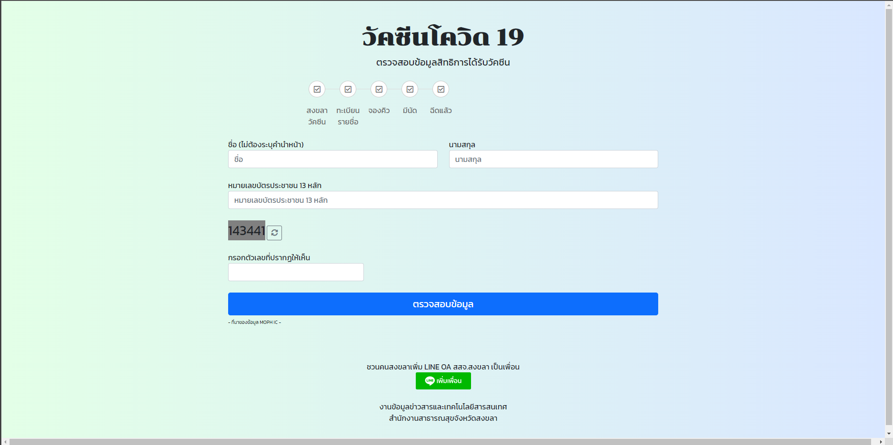
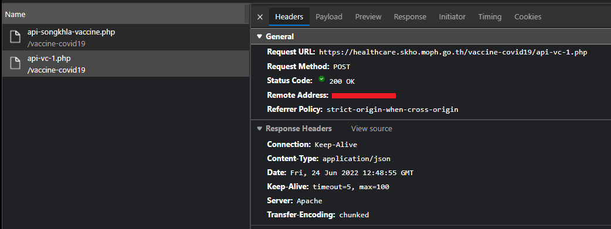
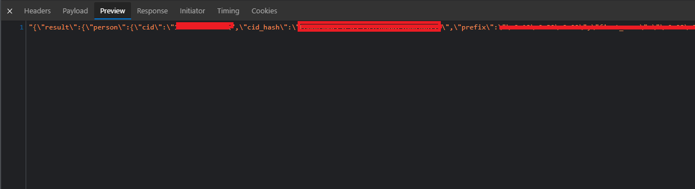
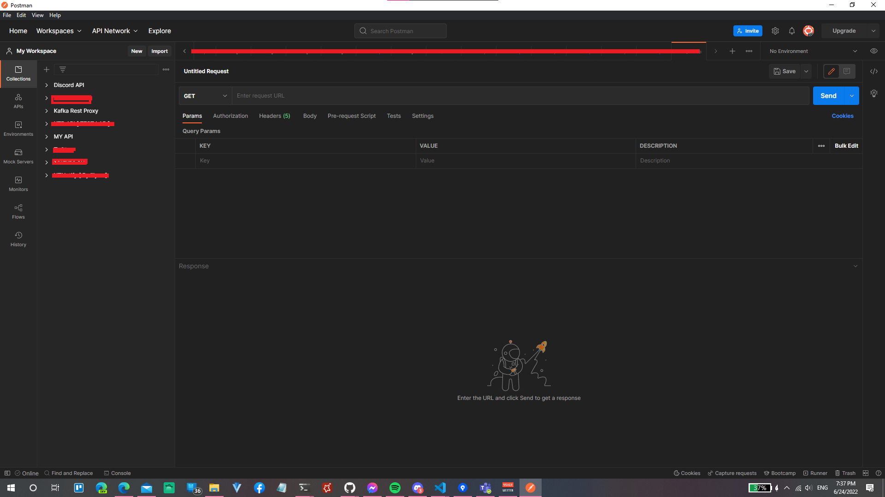
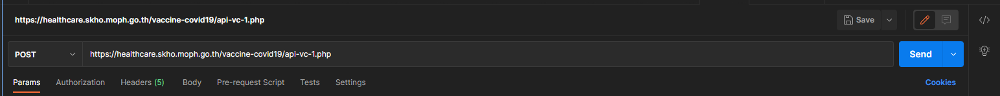
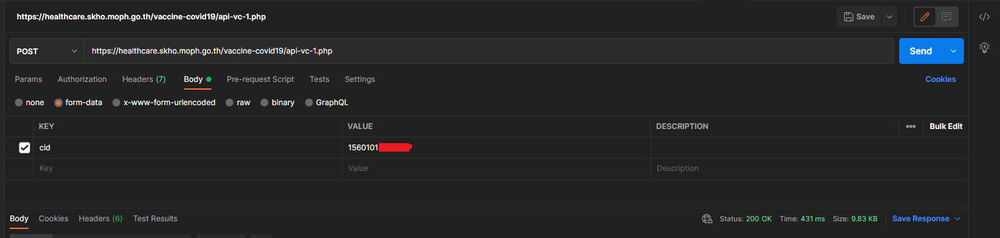
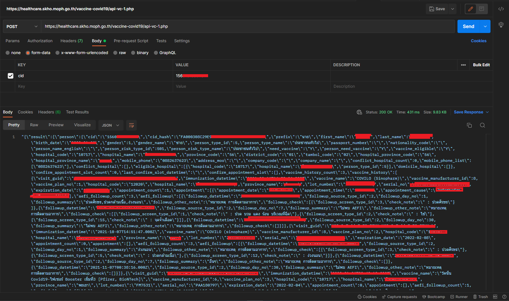

# METHOD ที่ 1 จากเว็บไซต์ healthcare
ในวิธีแรกนี้เป็นวิธีดึงที่มาจากเว็บไซต์อย่าง [วัคซีนโควิด 19 (healthcare)](https://healthcare.skho.moph.go.th/vaccine-covid19/check.html) 

โดยวิธีดึงนั้น จะใช้วิธีการดึงจาก API ที่หลังจากเราได้หลังกรอกข้อมูลเลข บชช. แล้ว ระบบจะทำการส่งคำขอ เพื่อขอข้อมูลวัคซีนมา

แต่ว่า แทนที่จะดึงสถานะกลับมา กลายเป็นดึงข้อมูลทั้งชื่อ ที่อยู่ โรงพยาบาล ประวัติรับวัคซีน และอื่น ๆ ที่ใช้กับแอพ "หมอพร้อม" เกือบทั้งหมด

## วิธีการดึง
วิธีการดึงนั้นจำเป็นต้องมีโปรแกรมอย่าง Postman หรือ Thunder Client เพื่อทำการนำไปขอข้อมูล

จากนั้นทำการดึง URL ดังนี้ `https://healthcare.skho.moph.go.th/vaccine-covid19/api-vc-1.php`
และทำการตั้งการส่งข้อมูลเป็น POST

ต่อไปทำการตั้งไปที่ Body เลือกเป็น `form-data` และในช่อง `cid` กรอกเลข บชช.

สุดท้ายทำการกด `"Send"` เพื่อส่งขอข้อมูล
