# METHOD 2 ดึงผ่าน API จากแอพ "หมอพร้อม"
วิธีนี้เป็นวิธีที่ดึงข้อมูลจากในแอพ "หมอพร้อม" ซึ่งเป็นแอพไว้สำหรับดูข้อมูลประวัติฉีดวัคซีน ข้อมูลผู้ใช้งาน ใบ Certificate และ อื่น ๆ อีกมากมาย
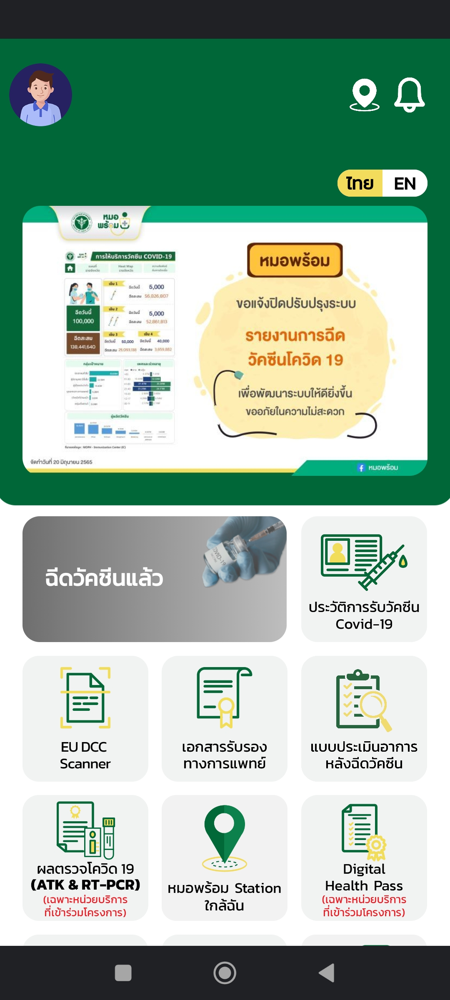

แต่ว่า ในแอพนี้ก็ทำพลาดเช่นเดียว กันแต่เป็นคนละเคสใน [Method1](../method_1/README.md)

## ความเป็นมา ขณะที่เจอช่องโหว่
ในช่วงนั้นที่ผมชอบไป Reverse API ของแอพอื่น ๆ ที่ไม่เกี่ยวกับธนาคารอยู่นั้น จู่ ๆ
ก็นึกอยากลองจะ Reverse API แอพ "หมอพร้อม" เพื่อนำมาใช้ส่วนตัว และเอาใบรับรองฉีด Vaccince ของผม โดยใช้วิธีการ Web Debugging
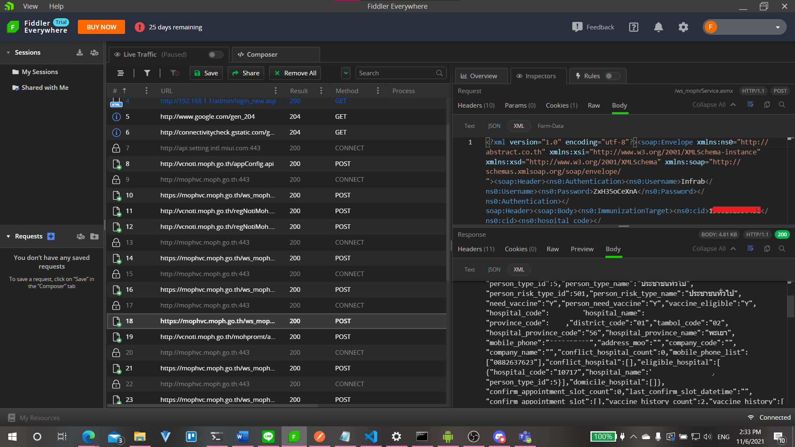
แต่พอ Reverse API ออกมาแล้วก็ เอ๊ะ ทำไมมันแปลก ๆ บางอย่าง มีดังนี้
- 1. ไม่มีการป้องกัน Cert Pinning
- 2. ตอนช่วงเข้าสู่ระบบ มีความผิดปกติ ทั้ง ๆ ที่ต้องควรส่ง Token จากฝั่ง Server มากลับกลายเป็นข้อมูลเปล่า
- 3. ตอนขอข้อมูล กลับเป็นส่งข้อมูล CID หรือบัตร บชช. ไปแทนที่จะส่ง Token ของผู้ใช้ไป


พอผมลองตรวจก็ถึงเข้าใจ และเป็นสิ่งที่แย่มาก ๆ โดยเป็นภาพดังนี้
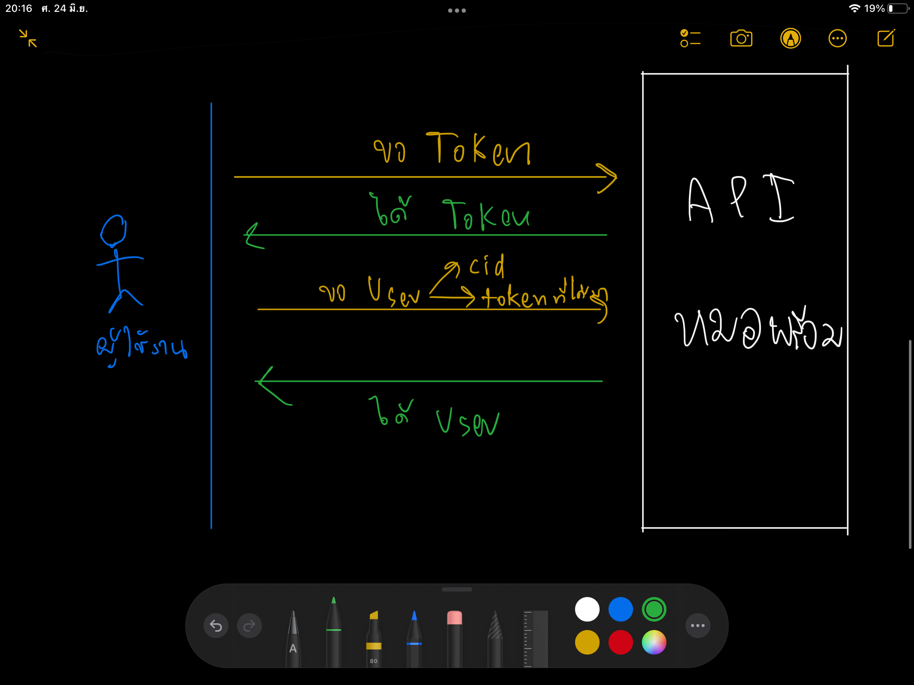

โดยขอ Token นั้น เป็นแค่ขอ Token หรือ Login จากเว็บไซต์ http://abstract.co.th
ซึ่งพอหลังจากได้ Token แล้วเราก็แค่ส่ง Token และเลข บชช. ไปเพื้อดึงข้อมูล บชช. ได้เลยโดยที่ไม่ต้องเช็ค User ในแอพหมอพร้อม

## วิธีการดึง
วิธีการดึงนั้นจำเป็นต้องมีโปรแกรมอย่าง Postman หรือ Thunder Client เพื่อทำการนำไปขอข้อมูล


โดยวิธีการดึงข้อมูลนั้นจะใช้ URL แค่ตัวเดียวเดียว ซึ่งก็คือ `https://mophvc.moph.go.th/ws_moph/Service.asmx`

### ขั้นตอนแรกทำการขอ Token จากเว็บไซต์ http://abstract.co.th เพื่อนำไปดึงข้อมูล บชช.
1. ทำการกรอกในส่วน Header ดังนี้
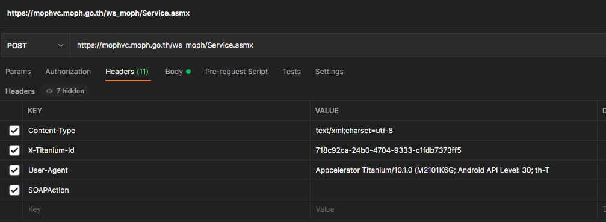
ในส่วนนี้จะมีดังนี้
```
Content-Type: text/xml;charset=utf-8 // ชนิดข้อมูลที่ส่ง

X-Titanium-Id: 718c92ca-24b0-4704-9333-c1fdb7373ff5 // Titanium Mobile SDK UUID

User-Agent: Appcelerator Titanium/10.1.0 (M2101K6G; Android API Level: 30; th-TH;) // User-Agent ของ Titanium Mobile SDK

SOAPAction: http://abstract.co.th/CreateApikey // ไม่แน่ใจว่าคืออะไร?
```

2. ทำการกรอกข้อมูล Body ดังนี้
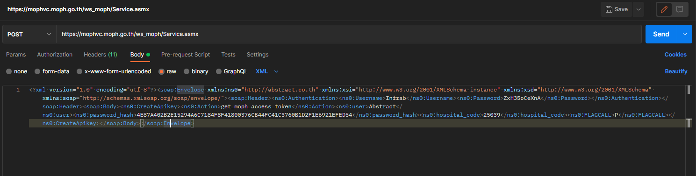

3. ทำการกด `Send`
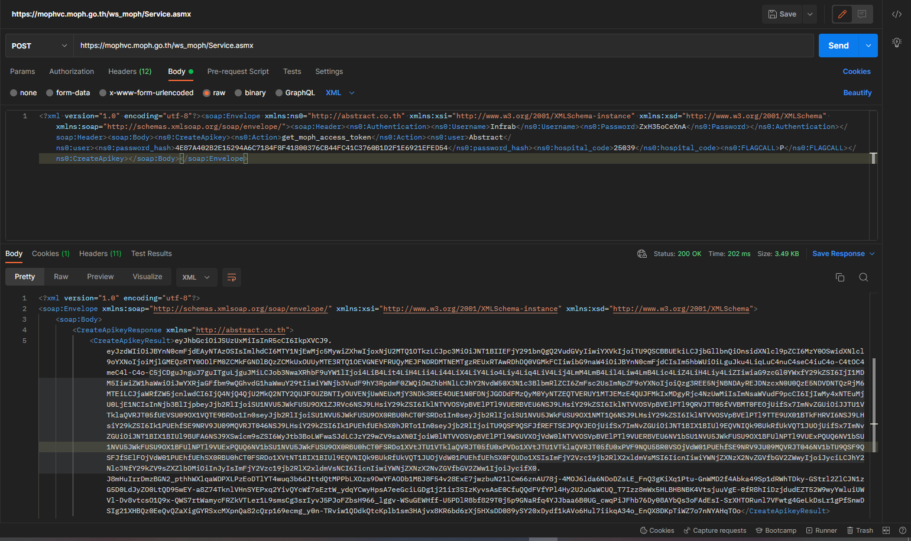

จะเห็นว่าจะมี `CreateApikeyResult` ให้ทำการคัดลอกไว้ใช้เพื่อดึงข้อมูลบชช.

### ขั้นตอนการดึงข้อมูล บชช.
ขั้นตอนนี้ไม่ต้องเปลี่ยนข้อมูลอะไร แต่ให้ ปิดข้อมูลใน Header และเปลี่ยนข้อมูลใน Body เป็นดังนี้
1. ให้ทำการนำ SOAPAction ออกจะได้ดังนี้
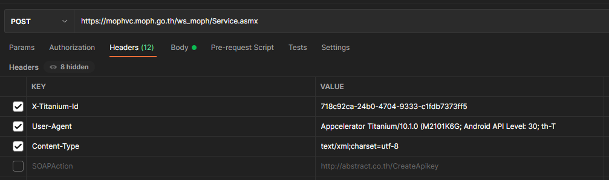

2. ทำการแก้ไขข้อมูลใน Body ดังนี้
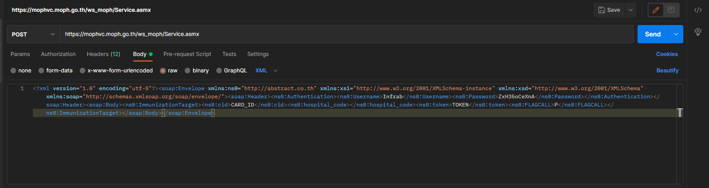

ในส่วนข้อมูล Body ให้แก้ไขดังนี้
```
CARD_ID = บัตรประชาชน
TOKEN = โทเค็น
```
หากแก้ไขแล้วจะเป็นดังนี้
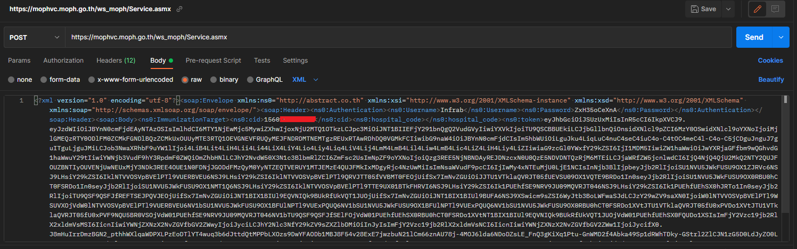

3. จากนั้นทำการกด `Send`
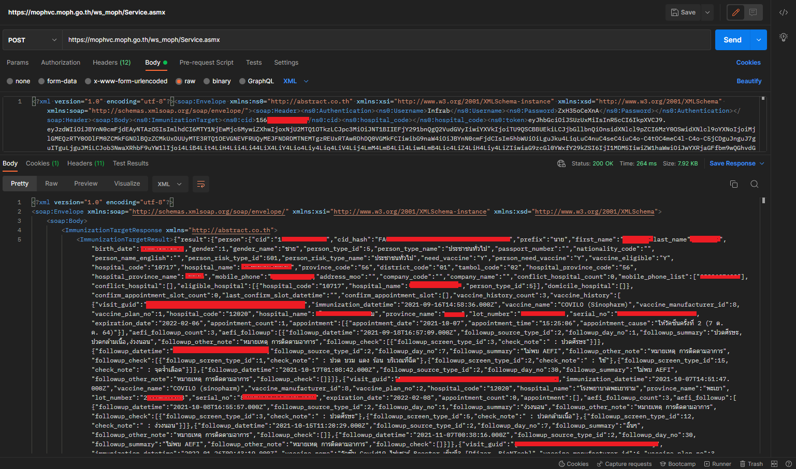

## ความคิดในการดึงข้อมูล
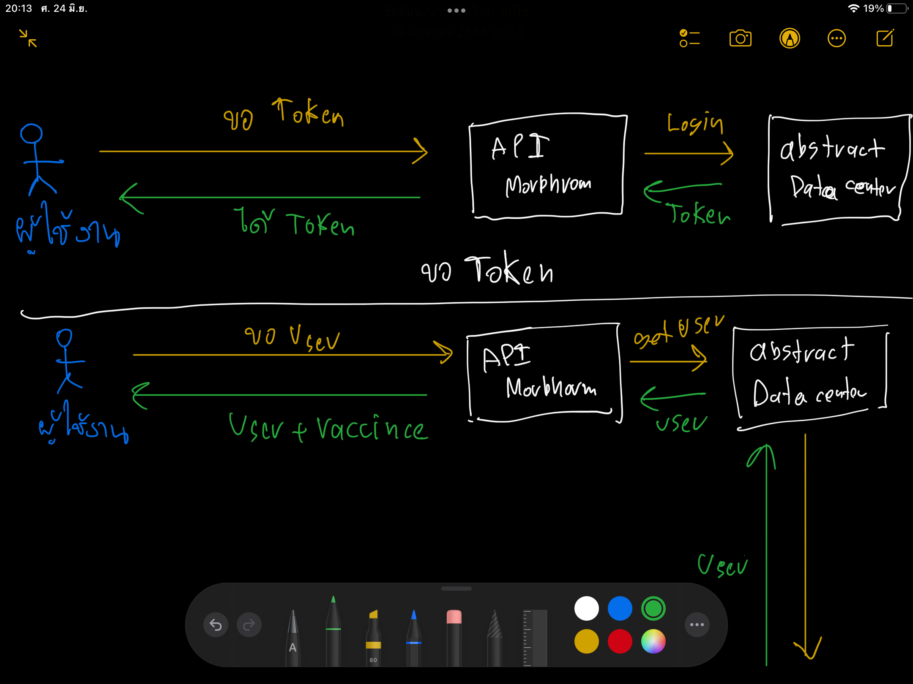